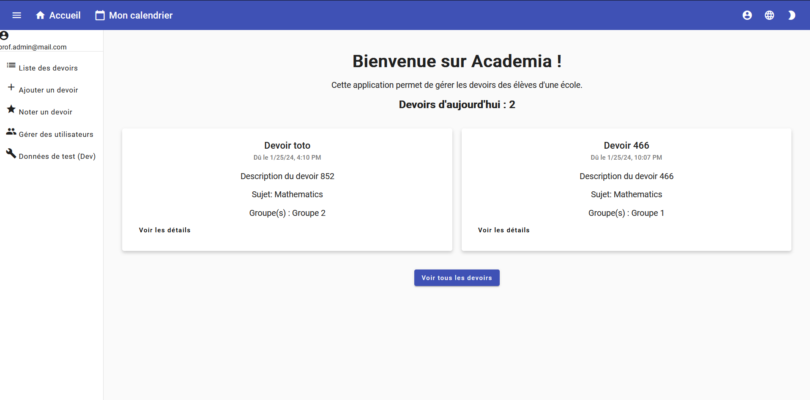
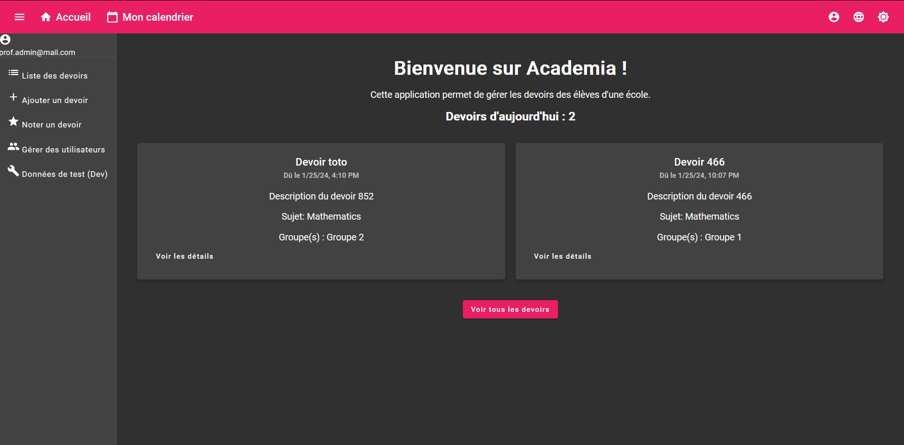

<h1 style="text-align: center;">📚 Academia</h1>

## Étudiants
- Larboullet-Marin Andréa
- Ripoll Théo

<p style="text-align: center;">
    Bienvenue à Academia - une application développée pour aider les utilisateurs à gérer, suivre et organiser leurs devoirs.
</p>

<p align="center">
   
   
</p>

Table des matières
=================

- [Pré-requis](#pré-requis)
- [Installation](#installation)
- [Exécution](#exécution)
- [Fonctionnalités](#fonctionnalités)
- [Contribution](#contribution)
- [Informations de Connexion](#informations-de-connexion)

## 🛠 Technologies utilisées

- **Frontend** : Angular
- **Backend** : Node.js

## 🚀 Mise en route

### Pré-requis

- ✅ Avoir [Node.js](https://nodejs.org/) et [npm](https://www.npmjs.com/) installés.

### 🔧 Installation

1. 📥 Clonez le dépôt :

   ```bash
   git clone <lien_du_dépôt>
   cd <nom_du_dossier_du_dépôt>
   ```

2. 🔙 Naviguez vers le dossier backend et installez les dépendances pour le backend :

   ```bash
   cd backend
   npm install
   ```

3. 🔝 Naviguez vers le dossier frontend et installez les dépendances pour Angular :

   ```bash
   cd frontend
   npm install
   ```

### 🖥️ Exécution

#### Exécuter localement

1. Naviguez vers le dossier backend et démarrez le backend :

   ```bash
   cd backend
   node index.js
   ```

2. Dans un autre terminal, naviguez vers le dossier frontend et démarrez l'application Angular :

   ```bash
   cd frontend
   ng serve
   ```

3. 🌍 Ouvrez votre navigateur et allez à `http://localhost:4200`.

## ⭐ Fonctionnalités

### En tant que professeur :

- ✨ **Ajouter un devoir** : Permet d'ajouter des nouveaux devoirs.
- 💼 **Modifier un devoir** : Permet de modifier les détails d'un devoir existant.
- ❌ **Supprimer un devoir** : Permet de supprimer un devoir existant.
- 🔍 **Consulter un devoir** : Permet de visualiser les détails d'un devoir spécifique.
- 📋 **Consulter une liste de devoirs** : Affiche tous les devoirs enregistrés.
- ⭐ **Noter les devoirs des élèves** : Permet de noter les devoirs soumis par les élèves.
- 🔄 **Générer un nombre N de devoirs** : Permet de générer un ensemble de devoirs en une seule action.
- 📅 **Consulter le calendrier de devoirs** : Affiche un aperçu des devoirs organisés par date.
- 🗓️ **Consulter les devoirs du jour** : Affiche une liste des devoirs planifiés pour le jour en cours.
- 🔧 **Filtrer et trier la liste de devoirs** : Permet de trier et de filtrer les devoirs selon différents critères à partir de la liste de devoirs.


### En tant qu'élève :

- 🗓️ **Consulter mes devoirs du jour** : Permet de visualiser les devoirs planifiés pour le jour en cours.
- ✅ **Marquer le devoir comme soumis** : Permet de marquer un devoir comme étant soumis.
- ⭐ **Consulter la note et la remarque du professeur** : Permet de visualiser la note et les commentaires donnés par le professeur pour un devoir soumis.
- 🔧 **Trier la liste de mes devoirs** : Permet de trier la liste de mes devoirs selon différents critères.
- 📅 **Consulter mon calendrier de devoirs** : Affiche un aperçu de mes devoirs organisés par date.


### Informations de Connexion

Pour tester les différentes fonctionnalités en fonction du rôle, vous pouvez utiliser les identifiants suivants :

- **Professeur** :
    - Email : `prof.admin@mail.com`
    - Mot de passe : `admin`

- **Élève** :
    - Email : `student.admin@mail.com`
    - Mot de passe : `admin`

## Contribution

1. 🍴 Fork le repo (https://github.com/alarboulletmarin/Academia/fork)
2. 👯 Clonez le repo sur votre machine (`git clone https://github.com/alarboulletmarin/Academia.git`)
3. 🎈 Créez votre branche (`git checkout -b ma-branche`)
4. 📝 Faites vos modifications
5. 🚀 Commit vos modifications (`git commit -m 'Ajouté une fonctionnalité'`)
6. ⬆️ Poussez votre branche (`git push origin ma-branche`)
7. 🎉 Créez une nouvelle Pull Request


